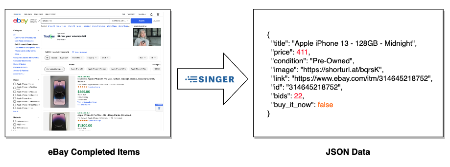

# tap-ebaycompleted

Author: Jay Grossman (jay@grossman.org)

This is a [Singer](http://singer.io) tap that produces JSON-formatted data following the [Singer spec](https://github.com/singer-io/getting-started/blob/master/SPEC.md).

## Description

This is a fun learning project with the goal to read in search results of eBay's completed items for a list of provided search terms. 



**Please Note:** You should not consider this a production quality tap. eBay often changes the format of the HTML on their search results page and this Tap will need to be updated when this occurs. 

## Usage

**Install**

I suggest running this is a python virtual environment:

```bash
cd tap-ebaycompleted
python3 -m venv ~/.virtualenvs/tap-ebaycompleted
source ~/.virtualenvs/tap-ebaycompleted/bin/activate
git clone git@github.com:jaygrossman/tap-ebaycompleted.git
cd tap-ebaycompleted
pip3 install .
pip3 install BeautifulSoup4
deactivate
```

**Create a configuration file**

There is a template you can use at `config.json.example`, just copy it to `config.json` in the repo root and update the following values:
```json
{
  "search_terms": ["iphone 13", "iphone 14"],
  "page_size": 240,
  "max_pages": 1,
  "min_wait": 2.1,
  "max_wait": 4.4
}
```

| Variable | Description |
| ----------- | ----------- |
| seacrh_terms | list of terms that the tap will search for **REQUIRED** |
| page_size | number of records to return - values can be 240,120,60 |
| max_pages | maximum number of search result pages to capture results from, default is 1 |
| min_wait | minimum amount of time between searches, default is 2 seconds |
| max_wait | maximum amount of time between searches, default is 5 seconds |

**Run the application to generate a catalog.**
```bash
~/.virtualenvs/tap-ebaycompleted/bin/tap-ebaycompleted -c config.json
```


## Sample Output
Below is a sample record representing a completed item:
```json
{
    "type": "RECORD", 
    "stream": 
    "completed_item_schema", 
    "record": {
        "search_term": "iphone 13", 
        "title": "Apple iPhone 13 - 128GB - Midnight", 
        "price": "$411.00", 
        "condition": "Pre-Owned", 
        "image": "https://shorturl.at/bqrsK", 
        "link": "https://www.ebay.com/itm/314645218752", 
        "id": "314645218752", 
        "bids": "", 
        "buy_it_now": false, 
        "end_date": "Jun 20, 2023", 
        "has_sold": true
    }
}
```

## Running the Tap + Target-Csv

**Install target-csv**
```bash
python3 -m venv ~/.virtualenvs/target-csv
source ~/.virtualenvs/target-csv/bin/activate
pip3 install target-csv
deactivate
```

**Run command to generate csv**

```bash
~/.virtualenvs/tap-ebaycompleted/bin/tap-ebaycompleted -c config.json.example | ~/.virtualenvs/target-csv/bin/target-csv 
```

## Change Log

**June 21, 2023**

Added 3 attributes to schema 
| attribute | Description |
| ----------- | ----------- |
| end_date | date the item listing ended |
| has_sold | indicates if the listing ended in a sale |
| search_term | term used to search for the completed item |

**June 27, 2023**

Added functionality to support capturing results from multiple pages. In the `config.json.example` file, the `max_pages` variable indiciates the maximum number of search result pages to capture results from. The default=1, the maximum value = 10.
